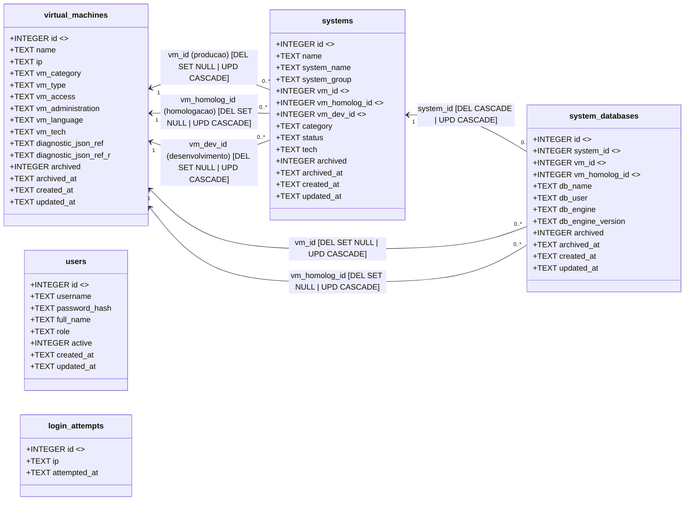

# Diagrama UML do Banco de Dados

Fonte do schema: `app/bootstrap.php`.

Observacao: os relacionamentos abaixo representam o modelo fisico no SQLite com `FOREIGN KEY` explicita (integridade referencial no banco).

## Relacoes FK (fisicas)

| Tabela filha | Coluna FK | Referencia | ON DELETE | ON UPDATE |
|---|---|---|---|---|
| `systems` | `vm_id` | `virtual_machines(id)` | `SET NULL` | `CASCADE` |
| `systems` | `vm_homolog_id` | `virtual_machines(id)` | `SET NULL` | `CASCADE` |
| `systems` | `vm_dev_id` | `virtual_machines(id)` | `SET NULL` | `CASCADE` |
| `system_databases` | `system_id` | `systems(id)` | `CASCADE` | `CASCADE` |
| `system_databases` | `vm_id` | `virtual_machines(id)` | `SET NULL` | `CASCADE` |
| `system_databases` | `vm_homolog_id` | `virtual_machines(id)` | `SET NULL` | `CASCADE` |
